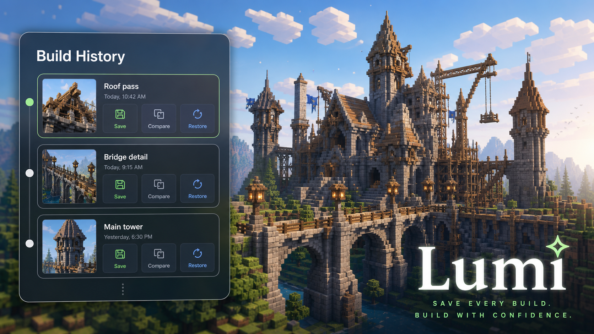
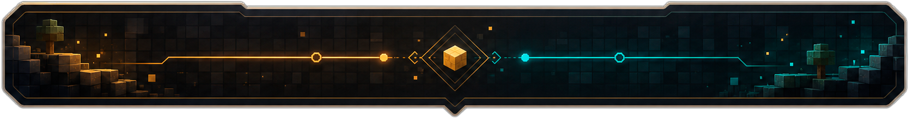
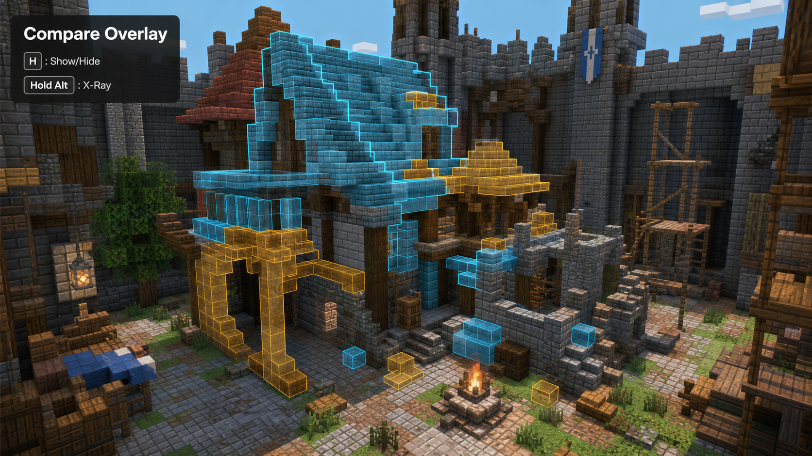
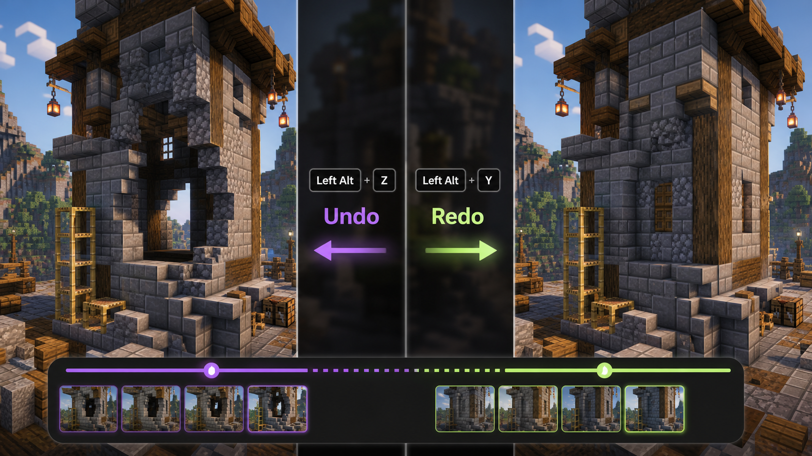
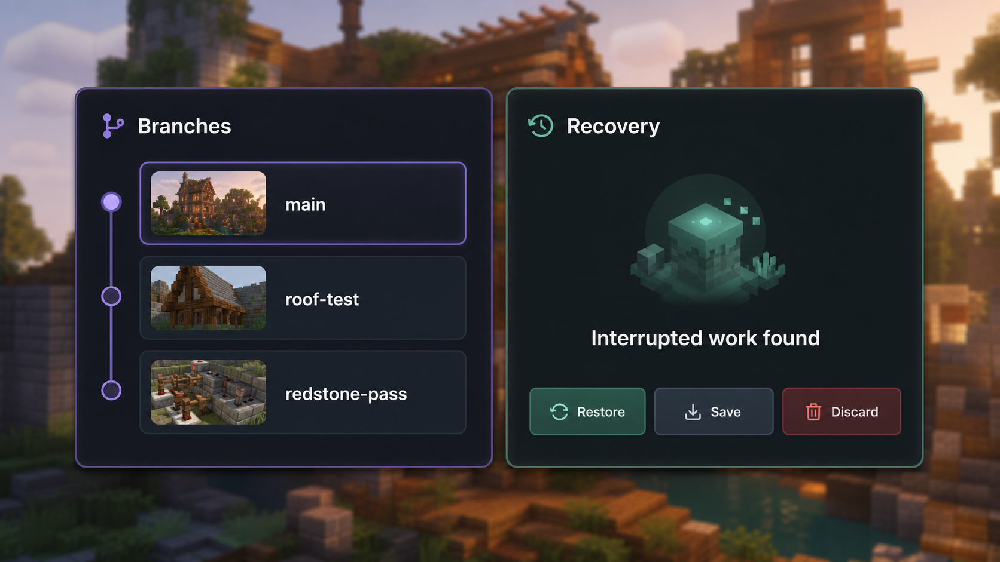
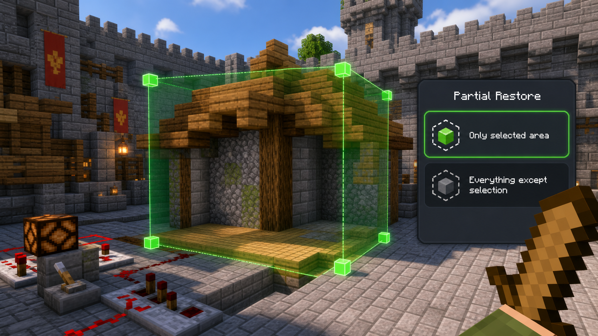

# Lumi

Stop duplicating world folders just to protect a build.

Lumi gives Minecraft builders project-style history: save versions, compare changes, branch ideas, roll back mistakes, recover interrupted work, and keep building with less fear.

**Focus:** build history, rollback, branching, compare, recovery, and undo/redo.

**For:** singleplayer builders, redstoners, map makers, and creative players who iterate a lot.

**Minecraft / Loader / Java:** Minecraft `1.21.11`, Fabric Loader `0.19.2+`, Java `21`.

**Status:** Alpha. Keep normal world backups.

## What To Expect

Lumi is for players who want a safer way to experiment with builds.

It is focused on:

- saving build milestones
- seeing what changed
- trying alternate directions
- restoring old states
- recovering interrupted work
- undoing recent tracked edits
- singleplayer and integrated-server workflows

It is not focused on:

- new blocks, items, mobs, biomes, or dimensions
- survival progression
- tech automation
- server claims or economy systems
- replacing normal world backups

## Features

### Save Your Build Like A Project

Turn a dimension or build area into a Lumi project. Save named versions as your build evolves, keep preview images and change stats, and return to earlier milestones without juggling copies of the entire save folder.

- Create project history for the current dimension or a tracked build area.
- Save named versions with stats, previews, and restore data.
- Use quick save for fast checkpoints while building.
- Rename saves, soft-delete old saves, and review deleted saves later.

### See What Changed

Lumi helps you inspect progress before you commit to a restore or merge.

- Compare a save with its parent.
- Compare two saves.
- Compare a branch head with another state.
- Compare a save with the current world.
- Highlight changed blocks in the world.
- Hold the Lumi action button to view compare highlights through blocks.

### Rollback Without Panic

Mistakes happen. Lumi gives you several ways back.

- Restore a full saved version.
- Quick rollback unsaved work to the active save.
- Restore only a selected region.
- Restore everything except a selected region.
- Track restore progress during longer operations.
- Undo and redo recent tracked actions without creating a full save first.

### Try Ideas With Branches

Want to test a roof shape, palette swap, redstone layout, or alternate facade without losing the stable version? Branch it.

- Create branches for alternate build directions.
- Switch between build directions.
- Merge local branch work back into the current branch.
- Export and import portable history packages.
- Export and import full project archives.
- Review imported projects before applying them.

### Recover Interrupted Work

Crashes and accidental closes should not automatically erase your latest work.

- Keep interrupted edits in recovery drafts.
- Restore, save, or discard recovered work.
- Use restore return points for safer restore workflows.
- Run cleanup tools for unused previews, caches, stale operation drafts, and orphaned data.
- Run integrity checks from the Lumi UI.

### Works With Builder Tools

Lumi captures normal player edits and a conservative set of builder-tool mutation paths.

Supported or partially supported paths include:

- WorldEdit
- FAWE-style chunk placement
- Axiom-style block buffers
- Axion
- AutoBuild
- SimpleBuilding
- Effortless Building
- Litematica/Tweakeroo placement paths
- other tools that modify blocks through normal Minecraft mutation paths

Builder-tool capture is best-effort because external tools change worlds in different ways. WorldEdit support is optional and does not add a hard runtime dependency.

## Hotkeys

All keybinds can be changed in Minecraft `Controls` -> `Lumi`.

| Default | Action |
| --- | --- |
| `U` | Open the current Build History workspace |
| `Left Alt+S` | Open Quick save |
| `Left Alt+Z` | Undo the latest tracked action |
| `Left Alt+Y` | Redo the latest undone tracked action |
| Hold `Left Alt` | Preview next undo/redo targets, or use compare x-ray when compare is active |
| `R` | Quick rollback unsaved work, or only the selected area when a Lumi selection is active |
| `H` | Hide or show the active compare overlay |
| `Left Alt+I` | Open the Lumi hotkey information table |

`Left Alt` is the default Lumi action button. Rebinding it changes the shortcuts that use it.

## Region Selection

Use a wooden sword as Lumi's selection tool.

| Input | Action |
| --- | --- |
| Left click in `corners` mode | Set corner A |
| Right click in `corners` mode | Set corner B |
| Left click in `extend` mode | Expand the selected bounds |
| Right click in `extend` mode | Reset the selection to the looked-at block |
| Lumi action button + scroll | Toggle `corners` / `extend` mode |
| Lumi action button + right click | Clear the selection |

Selections are used for partial restore and selected-area quick rollback.

## Client / Server

Required on:

- Client: Yes
- Server: Yes, when used on a dedicated server

Support:

- Singleplayer: Supported and primary target
- Integrated server: Supported
- Dedicated server: Available, but not the main target
- Server-side only: No
- Client-side only: No

Lumi is singleplayer-first. Multiplayer and dedicated-server use should be treated as advanced usage.

## Installation

1. Install Fabric Loader for Minecraft `1.21.11`.
2. Install Fabric API.
3. Install Lumi and its required dependencies.
4. Put the `.jar` files in your `mods` folder.
5. Launch the game.

## Dependencies

Required:

- Fabric Loader `0.19.2+`
- Fabric API `0.141.3+1.21.11`
- Java `21+`
- owo-lib `0.13.0+1.21.11`
- Cloth Config `21.11.153+`

Bundled inside Lumi:

- lz4-java

Optional:

- WorldEdit
- FAWE-compatible tools
- Axiom
- other builder tools listed above

Dependencies should also be set in the Modrinth version metadata.

## Compatibility

Known:

- Designed for Minecraft `1.21.11`.
- Designed for Fabric.
- Built for singleplayer and integrated-server creative/building workflows.
- Optional builder-tool support is best-effort and conservative.

Not guaranteed:

- Large public multiplayer servers.
- Heavy modpacks that replace core world mutation behavior.
- Every version of every builder tool.
- Use as a replacement for normal world backups.

## Known Issues And Risks

- Lumi is alpha software. Keep normal world backups.
- Existing pre-Lumi worlds may show a one-time safety checkpoint gate before opening.
- Very large restores can take time, but should report progress.
- Builder-tool capture depends on how the external tool changes the world.

## FAQ

**Does Lumi add blocks, items, mobs, or worldgen?**

No. Lumi adds build history tools and UI.

**Can I use it on an existing world?**

Yes, but keep a backup. Existing pre-Lumi worlds may need the safety checkpoint step.

**Is this only for singleplayer?**

Singleplayer is the primary target. Dedicated server use exists but is not the main focus.

**Does it replace world backups?**

No. Lumi helps with build history, restore, recovery, and iteration. You should still keep normal backups.

**Can I use it in a modpack?**

Yes, as long as the license and dependencies are respected. Test carefully in large packs.

## Credits

- Developer: Zlo
- Translations: Lumi project contributors

## License

Lumi is licensed under `GPL-3.0-only`.
